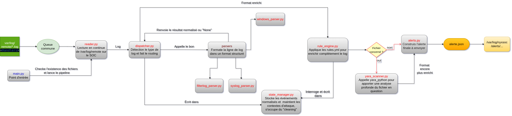

# Engine — Moteur de corrélation NyxSOC

**Module** : Corrélation stateful multi-sources  
**Langage** : Python 3.13  
**Style** : Google Docstrings + Type Hints (`mypy` strict)  
**Dépendances** : `pyyaml>=6.0`, `watchdog>=4.0`, `jsonschema>=4.0`, `yara-python>=4.3`, `pytest>=8.0`, `mypy>=1.0`, `flake8>=7.0`  
**Environnement cible** : Debian 13, SOC 10.0.1.10

---

## 1. Vue d'ensemble

Le moteur de corrélation est le composant central de NyxSOC. Il ingère des événements de sécurité issus de sources hétérogènes, les normalise en un schéma JSON unifié, maintient un état persistant dans SQLite, évalue des règles de détection YAML et publie des alertes structurées vers le module SOAR via écriture atomique de fichiers JSON.

### Principe fondamental

Le moteur ne décide pas de la gravité d'un événement isolé. Il détecte des **chaînes d'événements** — des séquences temporelles qui prises ensemble constituent une attaque. La décision de réponse appartient exclusivement au module SOAR. Le moteur produit des **faits classifiés**, pas des ordres.

### Style de code

Tout le code respecte **Google Docstrings + Type Hints**. `mypy` valide les types statiquement, `flake8` valide le style.

---

## 2. Architecture



### Flux de données

```
/var/log/remote/*.log
        │ inotify (watchdog)
        ▼
    reader.py
    FileSystemEventHandler par fichier, queue commune (ligne, nom_fichier)
        │
        ▼
    dispatcher.py
    routing config.yaml → parser + validation EventValidator
    YARA systématique sur tout samba_write
        │
        ├── syslog_parser.py     ← srv-pme.log
        ├── filterlog_parser.py  ← OPNsense.internal.log
        ├── windows_parser.py    ← NYX-PME.nyx.tg.log
        └── web_parser.py        ← localhost.log
        │
        │ dict normalisé (enrichi yara_match si samba_write)
        ▼
    state_manager.py
    SQLite WAL — table events + table contexts
        │ store_event()
        ▼
    rule_engine.py
    évalue toutes les règles YAML en mémoire
    interroge et écrit state_manager
        │
        ├── SSH_BRUTEFORCE_001 (Type 1)
        ├── WEB_BRUTEFORCE_001 (Type 1)
        ├── SMB_EXFIL_001 (Type 3)
        ├── MALICIOUS_FILE_EXEC_001 (Type 2)
        ├── SMB_MALICIOUS_FILE_001 (Type 4)
        ├── KERBEROASTING_001 (Type 1)
        └── ASREP_ROASTING_001 (Type 1)
        │
        ▼
    alerter.py
        ├── WARNING  → alerts.log
        └── CRITICAL → alert_<uuid>.json → /var/log/nyxsoc/alerts/
                                            [Module SOAR]

    main.py orchestre tout, purge périodique, arrêt propre
```

---

## 3. Structure du projet

```
engine/
  main.py                    # Point d'entrée, orchestration, threads, signaux
  reader.py                  # Surveillance inotify, position-tracking fichiers
  dispatcher.py              # Route → parse → validate → YARA → store → evaluate → alert
  validator.py               # Validation jsonschema + taxonomie fermée event_types
  parsers/
    base_parser.py           # ABC, parse_timestamp (RFC 5424/3164/NXLog)
    syslog_parser.py         # Debian/Linux — SSH, Samba, audit Samba (JSON)
    filterlog_parser.py      # OPNsense — CSV BSD filterlog
    windows_parser.py        # Windows — NXLog XML → EventLog / Sysmon
    web_parser.py            # Dolibarr — Apache Combined Log Format
  state_manager.py           # Persistance SQLite WAL (events + contexts)
  rule_engine.py             # Évaluation règles YAML (4 types)
  yara_scanner.py            # Scan YARA fichiers sur samba_write
  alerter.py                 # Publication WARNING/CRITICAL, atomic JSON
  config.yaml                # Configuration sources, chemins, rétention, hosts
  requirements.txt           # Dépendances Python
  Dockerfile                 # Image de test Python 3.13
  Makefile                   # Automation tests / lint / typecheck (docker-first)
  rules/
    attack/                  # 7 règles de détection YAML
      ssh_bruteforce.yaml
      web_bruteforce.yaml
      smb_exfil.yaml
      malicious_file.yaml
      smb_malicious_file.yaml
      kerberoasting.yaml
      asrep_roasting.yaml
    yara/
      malware_generic.yar    # Signatures YARA (neo23x0)
  tests/
    unit/                    # Tests par module (138 tests)
    integration/             # Tests pipeline complet
    fixtures/                # Logs synthétiques par source
  docs/
    alert-schema.json        # Schéma JSON validation alertes
    rule-schema.json         # Schéma JSON validation règles YAML
engine.db                    # Généré au runtime — NON versionné
```

---

## 4. Modules

### 4.1 main.py

Point d'entrée. Aucune logique métier — orchestration uniquement.

**Ordre d'instanciation obligatoire** :
```
StateManager → YaraScanner → RuleEngine(state, yara, hosts_map)
→ Alerter → Validator → Dispatcher(parsers, validator, state, yara, alerter)
→ Reader(dispatcher, config)
```

**Responsabilités** :
- Charger et valider `config.yaml`
- Vérifier l'existence de `/var/log/remote/`
- Lancer les threads : Reader (watchdog), consommateur queue, purge horaire
- Intercepter `SIGTERM` / `SIGINT` pour arrêt propre
- Appeler `state_manager.purge_old_events()` et `state_manager.expire_contexts()` toutes les heures

**Concept clé — Injection de dépendance** : `StateManager` est instancié une fois dans `main.py` et passé en paramètre à tous les modules. Aucun module ne l'instancie lui-même. Permet `StateManager(":memory:")` dans les tests.

**Bibliothèques** : `threading`, `signal`, `logging`, `pathlib`, `yaml`

---

### 4.2 reader.py

Surveille `/var/log/remote/` via `watchdog` (inotify). Un `FileSystemEventHandler` par fichier source maintient un pointeur de position (`dict[str, int]`) pour ne lire que les nouvelles lignes. Chaque ligne est poussée dans la queue commune sous la forme `(ligne: str, nom_fichier: str)`.

**Rotation copytruncate** : si le fichier rétrécit (`current_size < pos`), le pointeur est réinitialisé à 0 pour éviter de lire des données corrompues.

**Politique de dépassement** : queue max `config.queue.maxsize` (défaut 10 000). En cas de dépassement, ligne rejetée et anomalie loggée — limite documentée H-E3.

**Bibliothèques** : `watchdog`, `queue`, `threading`

---

### 4.3 dispatcher.py

Consomme la queue dans un thread dédié. C'est le **gardien du contrat de données**.

**Séquence pour chaque tuple `(ligne, nom_fichier)`** :
1. `config.sources[nom_fichier]` → type de parser
2. `parser.parse(ligne)` → `dict | None`
3. Si `None` : ligne ignorée silencieusement
4. `EventValidator.validate(event)` → `bool`
5. Si invalide : log WARNING + rejet
6. Si `event["event_type"] == "samba_write"` : appeler `yara_scanner.scan(filepath)` et enrichir `event["yara_match"]`
7. `state_manager.store_event(event)`
8. `rule_engine.process_event(event)` → `list[dict] | None`
9. Si alertes : `alerter.send(alerte)` pour chacune

**Point clé** : YARA est appelé **dans le Dispatcher**, pas dans le RuleEngine. Tout `samba_write` est enrichi avant stockage, quelle que soit la règle qui évaluera ensuite.

**Bibliothèques** : `jsonschema`, `yaml`, `logging`

---

### 4.4 validator.py

`EventValidator` encapsule `jsonschema.validate()` contre le schéma de l'événement normalisé. Une seule méthode publique : `validate(event: dict) -> bool`.

Deux niveaux de validation :
1. **Schéma jsonschema** : types, champs requis, `additionalProperties: false`
2. **Taxonomie fermée** : `event_type` doit appartenir à `_VALID_EVENT_TYPES` (14 types)

**Bibliothèques** : `jsonschema`, `logging`

---

### 4.5 parsers/

Tous les parsers héritent de `BaseParser` (ABC) et implémentent `parse(line: str) -> dict | None`.

#### Contrat de sortie

```python
{
    "timestamp":   int,         # Unix ms — OBLIGATOIRE
    "source_host": str,         # Hostname émetteur — OBLIGATOIRE
    "event_type":  str,         # Taxonomie fermée — OBLIGATOIRE
    "actor_ip":    str | None,
    "actor_user":  str | None,
    "target_host": str | None,
    "target_port": int | None,
    "extra":       dict | None, # Champs spécifiques source
    "yara_match":  dict | None, # Renseigné par Dispatcher sur samba_write
    "raw_log":     str,         # Ligne brute — OBLIGATOIRE
}
```

**Convention stricte** : champs absents = `None`, jamais `""`.

#### Taxonomie fermée — 14 event_types

| event_type | Source | Événement |
|---|---|---|
| `ssh_failure` | Debian | Échec SSH |
| `logon_success` | Debian / Windows | Connexion réussie |
| `logon_failure` | Windows | Échec logon EventID 4625 |
| `samba_read` | Debian | Lecture fichier partage SMB |
| `samba_write` | Debian | Création/modification fichier partage SMB |
| `smb_failure` | Debian | Échec auth SMB |
| `http_request` | Debian | Requête Apache/Dolibarr |
| `net_scan` | OPNsense | Scan réseau filterlog |
| `firewall_block` | OPNsense | Paquet bloqué |
| `file_create` | Windows | Sysmon EventID 11 |
| `process_exec` | Windows | Sysmon EventID 1 |
| `net_connect` | Windows | Sysmon EventID 3 |
| `tgt_request` | Debian | Auth Samba TGT EventID 4768 |
| `tgs_request` | Debian | Auth Samba TGS EventID 4769 |

#### Principes communs

- Regex compilées dans `__init__()`, jamais dans `parse()`
- Flag `debug: bool = False` à l'init pour logguer les lignes ignorées
- `parse_timestamp()` partagée dans `BaseParser` — une seule implémentation RFC 5424/3164/NXLog

#### syslog_parser.py

Parse les logs syslog Debian/Linux. Dispatch interne par champ `program` :

- `sshd` → `ssh_failure` / `logon_success`
- `smbd` → `samba_read` / `samba_write` / `smb_failure`
- `samba-audit` → `tgt_request` (EventID 4768) / `tgs_request` (EventID 4769) via JSON embarqué
- `nmbd` → ignoré

**Bibliothèques** : `re`, `json`, `datetime`

#### filterlog_parser.py

Parse les logs OPNsense au format CSV BSD. Gère IPv4/IPv6, TCP/UDP/ICMP.

- `block in` → `net_scan`
- `block out` → `firewall_block`
- `pass in/out` → `net_connect`

**Bibliothèques** : `re`, `datetime`

#### windows_parser.py

Deux couches : déshabillage enveloppe syslog NXLog, puis parsing XML via `xml.etree.ElementTree`.

Dispatch sur `EventID` :
- 4624 → `logon_success`
- 4625 → `logon_failure`
- 1 → `process_exec` (Sysmon)
- 3 → `net_connect` (Sysmon)
- 11 → `file_create` (Sysmon)

**Bibliothèques** : `re`, `datetime`, `xml.etree.ElementTree`

#### web_parser.py

Parse les logs web Dolibarr au format Apache Combined Log, émis par le processus `dolibarr` sur `localhost`.

- `dolibarr` / `apache2` / `httpd` → `http_request`

Extrait : `http_method`, `http_path`, `http_status`, `user_agent`, `referer`, `response_size`, `pid`.

**Bibliothèques** : `re`, `datetime`

---

### 4.6 state_manager.py

Interface unique avec SQLite. Instancié une fois dans `main.py`, passé par injection de dépendance.

**Pragmas à l'init** :
```sql
PRAGMA journal_mode=WAL;
PRAGMA synchronous=NORMAL;
PRAGMA busy_timeout=5000;
```

**Concurrence** : `check_same_thread=False` + `threading.Lock()` sur les écritures uniquement. Lectures libres — WAL garantit la cohérence.

#### Table `events`

```sql
CREATE TABLE IF NOT EXISTS events (
    id          INTEGER PRIMARY KEY AUTOINCREMENT,
    timestamp   INTEGER NOT NULL,
    source_host TEXT    NOT NULL,
    event_type  TEXT    NOT NULL,
    actor_ip    TEXT,
    actor_user  TEXT,
    target_host TEXT,
    target_port INTEGER,
    extra       TEXT,        -- dict sérialisé JSON
    yara_match  TEXT,        -- dict sérialisé JSON | NULL
    raw_log     TEXT NOT NULL
);
CREATE INDEX IF NOT EXISTS idx_events_ts      ON events(timestamp);
CREATE INDEX IF NOT EXISTS idx_events_type_ip ON events(event_type, actor_ip);
```

#### Table `contexts`

```sql
CREATE TABLE IF NOT EXISTS contexts (
    id         INTEGER PRIMARY KEY AUTOINCREMENT,
    rule_id    TEXT    NOT NULL,
    actor_ip   TEXT    NOT NULL,
    state      TEXT    NOT NULL,  -- 'pending' | 'escalated' | 'expired'
    step       INTEGER DEFAULT 0,
    first_seen INTEGER NOT NULL,
    last_seen  INTEGER NOT NULL,
    extra      TEXT               -- données accumulées (JSON)
);
CREATE INDEX IF NOT EXISTS idx_contexts_rule_ip ON contexts(rule_id, actor_ip);
```

**Bibliothèques** : `sqlite3`, `json`, `time`, `threading`

---

### 4.7 rule_engine.py

Reçoit chaque événement normalisé et évalue toutes les règles YAML chargées en mémoire à l'init. Utilise `hosts_map` (depuis `config.yaml`) pour résoudre `target_ip` dans les alertes.

**Méthode publique** :
```python
def process_event(self, event: dict) -> list[dict] | None
```

**Quatre types de règles** :

| Type | Mécanisme | Exemple |
|---|---|---|
| 1 | Seuil simple : `count_events >= threshold` dans `window_seconds` | SSH_BRUTEFORCE_001 |
| 2 | Étapes séquentielles : machine à états avec contexte persisté | MALICIOUS_FILE_EXEC_001 |
| 3 | Co-occurrence : tous les `event_types` requis présents dans la fenêtre | SMB_EXFIL_001 |
| 4 | YARA directe : `samba_write` + `yara_match` présent | SMB_MALICIOUS_FILE_001 |

**Chargement des règles** : à l'init, parcours de `rules/attack/*.yaml`, chargement via `yaml.safe_load()`, validation contre `docs/rule-schema.json` via `jsonschema`. Règle invalide → log ERROR + ignorée, pas de crash.

**Bibliothèques** : `pyyaml`, `fnmatch`, `time`, `uuid`, `jsonschema`

---

### 4.8 yara_scanner.py

Appelé par le **Dispatcher** sur tout `samba_write`. Non appelé par le RuleEngine. Enrichit l'événement avant stockage.

**Méthode publique** :
```python
def scan(self, file_path: str) -> dict | None
```

**Accès aux fichiers** : le SOC monte les quatre partages Samba en read-only via CIFS (`/mnt/samba/{commun,direction,comptabilite,technique}/`). Tout fichier déposé sur un partage est scannable.

**Règles YARA** : `rules/yara/` — signatures `neo23x0/signature-base` filtrées sur `SUSP_*` et `MAL_*`. Compilées à l'init en un objet `yara.Rules`.

**Hash** : `hashlib.md5(file_bytes).hexdigest()` calculé avant le scan, inclus dans le résultat.

**Bibliothèques** : `yara-python`, `hashlib`, `pathlib`

---

### 4.9 alerter.py

Reçoit les alertes du RuleEngine. Responsabilité unique : publier.

- **WARNING** → `alerts.log` via `logging`
- **CRITICAL** → `alerts.log` + écriture atomique `alert_<uuid>.json` dans `/var/log/nyxsoc/alerts/`

**Écriture atomique** :
```python
with tempfile.NamedTemporaryFile(mode='w', dir=alerts_dir, delete=False, suffix='.tmp') as f:
    json.dump(alert, f, indent=2, ensure_ascii=False)
    tmp_path = f.name
os.rename(tmp_path, target)  # atomique sur Linux, même filesystem
```

Le SOAR ne voit jamais un fichier partiellement écrit.

**Bibliothèques** : `json`, `logging`, `tempfile`, `os`, `pathlib`, `uuid`

---

## 5. Format alert.json

Conforme au schéma `docs/alert-schema.json`.

```json
{
  "alert_id":        "uuid-v4",
  "timestamp":       1750000000000,
  "rule_id":         "SSH_BRUTEFORCE_001",
  "severity":        "CRITICAL",
  "attacker_ip":     "10.0.1.50",
  "target_host":     "debian-server",
  "target_ip":       "10.0.1.20",
  "mitre_tactic":    "TA0006",
  "mitre_technique": "T1110",
  "events": {
    "count": 10,
    "details": [
      {
        "timestamp":   1750000000000,
        "event_type":  "ssh_failure",
        "source_host": "srv-pme",
        "actor_user":  "root",
        "raw_log":     "Failed password for root from 10.0.1.50 port 52341 ssh2"
      }
    ]
  },
  "yara_match": null
}
```

**Règle troncature `events.details`** : ≤5 événements → tous gardés. >5 → 2 premiers + 2 derniers + `count` total.

**`soar_action` absent** : la décision de réponse appartient au SOAR.

---

## 6. Configuration

### config.yaml

```yaml
sources:
  "srv-pme.log":             "syslog"
  "localhost.log":           "web"
  "OPNsense.internal.log":   "filterlog"
  "NYX-PME.nyx.tg.log":      "windows"

# Résolution hostname -> IP statique de la topologie NyxSOC.
hosts:
  "srv-pme":               "10.0.1.20"
  "srv-pme.nyx.tg":        "10.0.1.20"
  "debian-server":         "10.0.1.20"
  "NYX-PME":               "10.0.1.30"
  "NYX-PME.nyx.tg":        "10.0.1.30"
  "OPNsense.internal":     "10.0.1.1"
  "localhost":             "10.0.1.20"

retention:
  events_hours: 24
  context_cleanup_interval_seconds: 3600

queue:
  maxsize: 10000

log_dir:    "/var/log/remote"
db_path:    "engine/engine.db"
alerts_dir: "/var/log/nyxsoc/alerts"
alerts_log: "/var/log/nyxsoc/engine.log"

samba_mounts:
  commun:        "/mnt/samba/commun"
  direction:     "/mnt/samba/direction"
  comptabilite:  "/mnt/samba/comptabilite"
  technique:     "/mnt/samba/technique"

soar:
  channel: "file"
  alerts_dir: "/var/log/nyxsoc/alerts"

rules:
  attack: "engine/rules/attack"
```

La clé `hosts` est utilisée par `RuleEngine` pour résoudre `target_ip` dans les alertes à partir du `source_host` de l'événement.

---

## 7. Tests

### Philosophie

Chaque classe est testable isolément grâce à l'injection de dépendance. `StateManager(":memory:")` dans tous les tests — aucune écriture disque.

### Unitaires (`tests/unit/`)

Un fichier par module, un test par responsabilité.

| Fichier | Tests | Couverture |
|---|---|---|
| `test_syslog_parser.py` | SSH, Samba, audit Samba | Parsing, extraction champs, ignored |
| `test_filterlog_parser.py` | OPNsense BSD CSV | Classification, IPv4/IPv6, extraction |
| `test_windows_parser.py` | NXLog XML | EventIDs 4624/4625/1/3/11 |
| `test_web_parser.py` | Apache Combined Log | Dolibarr, extraction champs HTTP |
| `test_validator.py` | EventValidator | Schéma, taxonomie, champs optionnels |
| `test_state_manager.py` | SQLite WAL | CRUD events, contexts, purge |
| `test_rule_engine.py` | RuleEngine | 4 types, hosts_map |
| `test_yara_scanner.py` | YaraScanner | Match, no match, unavailable |
| `test_alerter.py` | Alerter | build_alert, WARNING/CRITICAL, atomic write |
| `test_dispatcher.py` | Dispatcher | Pipeline, YARA enrich, routing |
| `test_reader.py` | Reader | inotify, rotation, queue full |

### Intégration (`tests/integration/`)

- `test_engine_full.py` : pipeline complet Dispatcher → State → RuleEngine → Alerter avec alertes critiques vérifiées
- `test_dispatcher_to_state.py` : validation JSON + stockage SQLite

### Commandes

```bash
cd engine/
make test                  # Tous les tests dans le conteneur
make test-unit             # Unitaires uniquement
make test-parsers          # Tests parsers
make lint                  # flake8
make typecheck             # mypy --strict
```

---

## 8. Permissions filesystem

```bash
# Utilisateur dédié moteur
sudo useradd -r -s /bin/false nyxsoc

# Lecture /var/log/remote/
sudo usermod -aG adm nyxsoc
sudo chmod 750 /var/log/remote/

# Écriture /var/log/nyxsoc/
sudo mkdir -p /var/log/nyxsoc/alerts/
sudo chown -R nyxsoc:nyxsoc /var/log/nyxsoc/

# Montages Samba read-only (dans /etc/fstab)
//10.0.1.20/commun       /mnt/samba/commun       cifs ro,username=soc_reader,... 0 0
//10.0.1.20/direction    /mnt/samba/direction    cifs ro,username=soc_reader,... 0 0
//10.0.1.20/comptabilite /mnt/samba/comptabilite cifs ro,username=soc_reader,... 0 0
//10.0.1.20/technique    /mnt/samba/technique    cifs ro,username=soc_reader,... 0 0
```

---

## 9. Hypothèses et limites

| Réf. | Hypothèse | Impact | Mitigation |
|---|---|---|---|
| H-E1 | Ordre temporel approximatif | Décalage 1-2s inter-sources | Fenêtres ≥ 60s — négligeable |
| H-E2 | Pas de pivoting inter-IP | Changement IP = deux contextes | Limite documentée, extension future |
| H-E3 | Queue en mémoire | Perte possible au crash | Événements SQLite préservés |
| H-E4 | YARA sur fichiers locaux Windows inaccessible | Fichiers C:\ non scannable | YARA sur partages Samba montés |
| H-E5 | Seuils calibrés lab | Faux positifs en production | Ajuster threshold/window en prod |
| H-E6 | Pas de hot-reload des règles | Redémarrage requis après modif | Acceptable pour 10 semaines |
| H-E7 | Taxonomie `event_type` dupliquée | Incohérence lors d'ajout d'un type | Maintenir 3 copies manuelles (voir ci-dessous) |

### Point de vigilance — Taxonomie `event_type` dupliquée

La taxonomie des 14 `event_type` est actuellement dupliquée à 3 endroits :

1. **`validator.py`** — `_VALID_EVENT_TYPES` (set Python) : utilisée par `EventValidator.validate()` au runtime pour rejeter les événements hors taxonomie.
2. **`docs/rule-schema.json`** — définition `event_type` (enum JSON) : utilisée par `jsonschema.validate()` dans `RuleEngine._load_rules()` pour valider les règles YAML à l'initialisation.
3. **`config.yaml`** — clé `event_types` (liste YAML) : **jamais lue par le code**. Configuration morte.

**Risque** : l'ajout d'un nouveau `event_type` nécessite de modifier les 3 fichiers. L'oubli de l'un d'eux provoque soit un rejet silencieux des événements (validator), soit une erreur de chargement des règles (schema), soit une incohérence de documentation (config).

---

## 10. Décisions architecturales

| Réf. | Décision | Alternative écartée | Justification |
|---|---|---|---|
| E-D1 | SQLite WAL | Redis | Local, sans serveur, suffisant pour le volume |
| E-D2 | Queue Python mémoire | Kafka, RabbitMQ | Volume max ~centaines/min — over-engineering |
| E-D3 | Injection de dépendance | Singleton | Testabilité maximale avec `:memory:` |
| E-D4 | Règles YAML custom | Sigma complet | Sigma hors scope — format inspiré de Sigma |
| E-D5 | `check_same_thread=False` + Lock | Une connexion par thread | Simple, suffisant |
| E-D6 | YARA dans Dispatcher | YARA dans RuleEngine | Enrichissement systématique sur tout `samba_write` |
| E-D7 | YARA sur partages montés | Agent YARA sur chaque VM | Pas d'agent — accès CIFS read-only |
| E-D8 | Écriture atomique fichier JSON | HTTP POST, socket | Découplage total, pas de dépendance réseau |
| E-D9 | BaseParser ABC | Duck typing | Contrat enforced à l'instanciation |
| E-D10 | `soar_action` absent | `soar_action` dans alerte | Décision de réponse = responsabilité SOAR |
| E-D11 | Type 4 YARA autonome | `check_yara` dans Type 2 | Couvre les uploads directs sans chaîne préalable |

---

## 11. Recommandations

### Court terme

1. **Supprimer la clé `event_types` de `config.yaml`** — configuration morte, source de confusion.
2. **Centraliser la taxonomie** - créer un fichier unique (`engine/event_types.py` ou `engine/taxonomy.yaml`) et générer `validator.py` + `rule-schema.json` à partir de cette source pour éviter les divergences lors des évolutions.

### Moyen terme

3. **CI/CD GitHub Actions** — automatiser `make test`, `make lint`, `make typecheck` sur chaque PR.
4. **Hot-reload des règles** — surveiller `rules/attack/` via inotify pour recharger les règles sans redémarrage (remplace H-E6).
5. **Métriques de détection** — ajouter des compteurs par règle (déclenchements, latence moyenne) pour calibrer les seuils en production.
