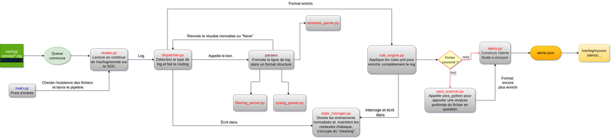

# Engine — Moteur de corrélation NyxSOC

**Module** : Corrélation stateful multi-sources  
**Langage** : Python 3.13
**Style** : Google Docstrings + Type Hints (`mypy` strict)  
**Dépendances** : `pyyaml>=6.0`, `watchdog>=4.0`, `jsonschema>=4.0`, `yara-python>=4.3`, `pytest>=8.0`, `mypy>=1.0`, `flake8>=7.0`  
**Environnement cible** : Debian 13, SOC 10.0.1.10

---

## 1. Vue d'ensemble

Le moteur de corrélation est le composant central de NyxSOC. Il ingère des
événements de sécurité issus de trois sources hétérogènes, les normalise en
un schéma JSON unifié, maintient un état persistant dans SQLite, évalue des
règles de détection YAML, et publie des alertes structurées vers le module
SOAR via écriture atomique de fichiers JSON.

### Principe fondamental

Le moteur ne décide pas de la gravité d'un événement isolé. Il détecte des
**chaînes d'événements** — des séquences temporelles qui prises ensemble
constituent une attaque. La décision de réponse appartient exclusivement
au module SOAR. Le moteur produit des **faits classifiés**, pas des ordres.

### Style de code 

Tout le code respecte **Google Docstrings + Type Hints** :

```python
def parse(self, line: str) -> dict | None:
    """Parse une ligne de log syslog RFC 5424.

    Args:
        line: Ligne brute issue de /var/log/remote/debian.log.

    Returns:
        Dict normalisé conforme au schéma EventNormalized,
        ou None si la ligne ne correspond à aucun pattern connu.

    Raises:
        ValueError: Si le timestamp ne peut pas être converti
            en Unix millisecondes.
    """
```

`mypy` valide les types statiquement. `flake8` valide le style.
Les deux sont intégrés dans le CI GitHub Actions.

---

## 2. Architecture



### Flux de données

```
/var/log/remote/*.log
        │ inotify (watchdog)
        ▼
    reader.py
    un handler par fichier, queue commune (ligne, nom_fichier)
        │
        ▼
    dispatcher.py
    routing config.yaml → parser + validation EventValidator
    YARA systématique sur tout samba_write
        │
        ├── syslog_parser.py     ← debian.log
        ├── filterlog_parser.py  ← OPNsense.internal.log
        └── windows_parser.py   ← DESKTOP-PME.log
        │
        │ dict normalisé (enrichi yara_match si samba_write)
        ▼
    state_manager.py
    SQLite WAL — table events + table contexts
        │ store_event()
        ▼
    rule_engine.py
    évalue toutes les règles YAML en mémoire
    interroge et écrit state_manager
        │
        ├── YARA_MALICIOUS_FILE_001 (Type 4) → alerte immédiate
        ├── SSH_BRUTEFORCE_001 (Type 1)
        ├── SMB_EXFIL_001 (Type 3)
        └── MALICIOUS_FILE_EXEC_001 (Type 2)
        │
        ▼
    alerter.py
        ├── WARNING  → alerts.log
        └── CRITICAL → alert_<uuid>.json → /var/log/nyxsoc/alerts/
                                            [Module SOAR — GAHOUNZO]

    main.py orchestre tout, purge périodique, arrêt propre
```

---

## 3. Structure des fichiers

```
engine/
  main.py                    # Orchestration, purge périodique, arrêt propre
  reader.py                  # Watchdog inotify, queue thread-safe commune
  dispatcher.py              # Routing, validation, YARA sur samba_write
  validator.py               # EventValidator — jsonschema événement normalisé
  parsers/
    base_parser.py           # BaseParser ABC + parse_timestamp() utilitaire
    syslog_parser.py         # Debian — SSH, Samba, Apache (RFC 5424)
    filterlog_parser.py      # OPNsense — filterlog BSD
    windows_parser.py        # Windows — XML EventLog + Sysmon via NXLog
  state_manager.py           # SQLite WAL — events + contexts
  rule_engine.py             # Évalue règles YAML, corrélation stateful
  yara_scanner.py            # Scan fichiers via yara-python
  alerter.py                 # Publie WARNING et CRITICAL
  rules/
    ssh_bruteforce.yaml
    smb_exfil.yaml
    malicious_file.yaml
    yara_malicious_file.yaml
    yara/
      malware_generic.yar
  tests/
    unit/
      test_syslog_parser.py
      test_filterlog_parser.py
      test_windows_parser.py
      test_state_manager.py
      test_rule_engine.py
      test_validator.py
      test_yara_scanner.py
    integration/
      test_dispatcher_to_state.py
      test_engine_full.py
    fixtures/
      sample_syslog.log
      sample_filterlog.log
      sample_windows.log
      eicar.txt              # Fichier test YARA (non malveillant)
  config.yaml
  requirements.txt
  engine.db                  # Généré au runtime — NON versionné
```

---

## 4. Modules

### 4.1 main.py

Point d'entrée. Aucune logique métier — orchestration uniquement.

**Ordre d'instanciation obligatoire** :
```
StateManager → YaraScanner → RuleEngine(state, yara)
→ Alerter → Validator → Dispatcher(parsers, validator, state, yara, alerter)
→ Reader(dispatcher, config)
```

**Responsabilités** :
- Charger et valider `config.yaml`
- Vérifier l'existence de `/var/log/remote/`
- Lancer les threads : Reader, consommateur queue, purge horaire
- Intercepter `SIGTERM` / `KeyboardInterrupt` pour arrêt propre
- Appeler `state_manager.purge_old_events()` et
  `state_manager.expire_contexts()` toutes les heures

**Concept clé — Injection de dépendance** : `StateManager` est instancié
une fois dans `main.py` et passé en paramètre. Aucun module ne l'instancie
lui-même. Permet de passer `:memory:` dans les tests.

**Bibliothèques** : `threading`, `signal`, `logging`, `pathlib`, `yaml`

---

### 4.2 reader.py

Surveille `/var/log/remote/` via `watchdog` (inotify). Un
`FileSystemEventHandler` par fichier source maintient un pointeur de
position (`dict[str, int]`) pour ne lire que les nouvelles lignes.
Chaque ligne est poussée dans la queue commune sous la forme
`(ligne: str, nom_fichier: str)`.

**Politique de dépassement** : queue max `config.queue.maxsize` (défaut
10 000). En cas de dépassement, ligne rejetée et anomalie loggée — limite
documentée H-E3.

**Bibliothèques** : `watchdog`, `queue`, `threading`

### Scénario 6 : Kerberoasting / AS-REP Roasting sur Samba AD
Un attaquant cible le contrôleur de domaine (Samba AD) pour extraire des tickets de service (TGS) ou des tickets TGT exploitables hors ligne.
* **Critère :** Génération rapide de multiples événements `tgs_request` ou `tgt_request` pour des SPNs distincts depuis la même IP source.
* **Corrélation :** Seuil simple dans une fenêtre courte.

---

### 4.3 dispatcher.py + validator.py

Le Dispatcher consomme la queue dans un thread dédié. Il est le
**gardien du contrat de données**.

**Séquence pour chaque tuple** :
1. Extraire `(ligne, nom_fichier)`
2. `config.sources[nom_fichier]` → type de parser
3. `parser.parse(ligne)` → `dict | None`
4. Si `None` : ligne ignorée silencieusement
5. `EventValidator.validate(event)` → `bool`
6. Si invalide : log WARNING + rejet
7. Si `event["event_type"] == "samba_write"` :
   appeler `yara_scanner.scan(filepath)` et enrichir `event["yara_match"]`
8. `state_manager.store_event(event)`
9. `rule_engine.process_event(event)` → `list[dict] | None`
10. Si alertes : `alerter.send(alerte)` pour chacune

**Point clé** : YARA est appelé **dans le Dispatcher**, pas dans le
RuleEngine. Tout `samba_write` est enrichi avant stockage, quelle que
soit la règle qui évaluera ensuite.

**EventValidator** (`validator.py`) : encapsule `jsonschema.validate()`
contre le schéma de l'événement normalisé. Une seule méthode publique
`validate(event: dict) -> bool`.

**Bibliothèques** : `jsonschema`, `yaml`, `logging`

---

### 4.4 parsers/

#### BaseParser — contrat abstrait

```python
# parsers/base_parser.py
from abc import ABC, abstractmethod


class BaseParser(ABC):
    """Contrat commun à tous les parsers NyxSOC.

    Tout parser concret doit implémenter parse(). Le Dispatcher
    ne connaît que cette interface — principe de substitution de Liskov.
    """

    @abstractmethod
    def parse(self, line: str) -> dict | None:
        """Parse une ligne de log brute en événement normalisé.

        Args:
            line: Ligne brute issue du fichier source.

        Returns:
            Dict conforme au schéma EventNormalized, ou None si
            la ligne ne correspond à aucun pattern connu.
        """
        ...

    def parse_timestamp(self, ts_str: str) -> int:
        """Convertit un timestamp string en Unix millisecondes.

        Supporte RFC 5424 (ISO 8601), RFC 3164 (BSD syslog),
        et le format NXLog Windows.

        Args:
            ts_str: Chaîne de timestamp à convertir.

        Returns:
            Timestamp Unix en millisecondes.

        Raises:
            ValueError: Si aucun format connu ne correspond.
        """
        ...
```

**Concept clé — ABC** : si un parser hérite de `BaseParser` sans
implémenter `parse()`, Python lève `TypeError` à l'instanciation.
Contrat enforced à l'exécution.

**Concept clé — LSP** : le Dispatcher appelle `parser.parse(line)` sans
savoir quel parser concret est derrière. 

#### Schéma de sortie garanti

```python
{
    "timestamp":   int,         # Unix ms — OBLIGATOIRE
    "source_host": str,         # Hostname émetteur — OBLIGATOIRE
    "event_type":  str,         # Taxonomie fermée — OBLIGATOIRE
    "actor_ip":    str | None,
    "actor_user":  str | None,
    "target_host": str | None,
    "target_port": int | None,
    "extra":       dict | None, # Champs spécifiques source
    "yara_match":  dict | None, # Renseigné par Dispatcher sur samba_write
    "raw_log":     str,         # Ligne brute — OBLIGATOIRE
}
```

**Convention stricte** : champs absents = `None`, jamais `""`.

#### Taxonomie fermée des event_type

| event_type | Source | Événement |
|---|---|---|
| `ssh_failure` | Debian | Échec SSH |
| `logon_success` | Debian / Windows | Connexion réussie |
| `logon_failure` | Windows | Échec logon EventID 4625 |
| `samba_read` | Debian | Lecture fichier partage SMB |
| `samba_write` | Debian | Création/modification fichier partage SMB |
| `smb_failure` | Debian | Échec auth SMB |
| `http_request` | Debian | Requête Apache/Dolibarr |
| `net_scan` | OPNsense | Scan réseau filterlog |
| `firewall_block` | OPNsense | Paquet bloqué |
| `file_create` | Windows | Sysmon EventID 11 |
| `process_exec` | Windows | Sysmon EventID 1 |
| `net_connect` | Windows | Sysmon EventID 3 |
| `tgt_request` | Debian | Auth Samba TGT EventID 4768 |
| `tgs_request` | Debian | Auth Samba TGS EventID 4769 |

#### Principes communs

- Regex compilées dans `__init__()`, jamais dans `parse()`
- Flag `debug: bool = False` à l'init pour logguer les lignes ignorées
- `parse_timestamp()` partagée dans `BaseParser` — une seule implémentation

#### syslog_parser.py

Dispatch interne par champ `program` :
```
parse() → _parse_envelope() → (ts, host, program, message)
  → program == "sshd"    : _parse_sshd()
  → program == "smbd"    : _parse_smbd()   # samba_read et samba_write
  → program == "apache2" : _parse_apache()
  → program == "nmbd"    : return None
  → else                 : return None
```

`_parse_smbd()` distingue `samba_read` (lecture) de `samba_write`
(création, modification) selon les mots-clés dans le message Samba.

#### filterlog_parser.py

Format CSV positionnel BSD. Les positions varient selon protocole
(TCP/UDP/ICMP) et version IP (v4/v6). Validation du nombre de champs
avant extraction pour éviter les `IndexError`.

#### windows_parser.py

Deux couches : déshabillage enveloppe syslog NXLog, puis parsing XML
via `xml.etree.ElementTree`. Attention aux namespaces XML :

```python
NS = {"e": "http://schemas.microsoft.com/win/2004/08/events/event"}
event_id = root.find("e:System/e:EventID", NS).text
```

Dispatch sur `EventID` : 4624→`logon_success`, 4625→`logon_failure`,
1→`process_exec`, 3→`net_connect`, 11→`file_create`.

**Bibliothèques parsers** : `re`, `datetime`, `xml.etree.ElementTree`

---

### 4.5 state_manager.py

Interface unique avec SQLite. Instancié une fois dans `main.py`, passé
par injection de dépendance.

**Pragmas à l'init** :
```sql
PRAGMA journal_mode=WAL;
PRAGMA synchronous=NORMAL;
PRAGMA busy_timeout=5000;
```

**Concurrence** : `check_same_thread=False` + `threading.Lock()` sur les
écritures uniquement. Lectures libres — WAL garantit la cohérence.

**Initialisation** : `_init_db()` dans `__init__()` crée les tables avec
`CREATE TABLE IF NOT EXISTS`. SQLite crée le fichier `.db` automatiquement.
Aucune intervention manuelle nécessaire.

#### Table `events`

```sql
CREATE TABLE IF NOT EXISTS events (
    id          INTEGER PRIMARY KEY AUTOINCREMENT,
    timestamp   INTEGER NOT NULL,
    source_host TEXT    NOT NULL,
    event_type  TEXT    NOT NULL,
    actor_ip    TEXT,
    actor_user  TEXT,
    target_host TEXT,
    target_port INTEGER,
    extra       TEXT,        -- dict sérialisé JSON
    yara_match  TEXT,        -- dict sérialisé JSON | NULL
    raw_log     TEXT NOT NULL
);
CREATE INDEX IF NOT EXISTS idx_events_ts      ON events(timestamp);
CREATE INDEX IF NOT EXISTS idx_events_type_ip ON events(event_type, actor_ip);
```

#### Table `contexts`

```sql
CREATE TABLE IF NOT EXISTS contexts (
    id         INTEGER PRIMARY KEY AUTOINCREMENT,
    rule_id    TEXT    NOT NULL,
    actor_ip   TEXT    NOT NULL,
    state      TEXT    NOT NULL,  -- 'pending' | 'escalated' | 'expired'
    step       INTEGER DEFAULT 0,
    first_seen INTEGER NOT NULL,
    last_seen  INTEGER NOT NULL,
    extra      TEXT               -- données accumulées (JSON)
);
CREATE INDEX IF NOT EXISTS idx_contexts_rule_ip ON contexts(rule_id, actor_ip);
```

#### Méthodes publiques

| Méthode | Signature | Retour | Appelé par |
|---|---|---|---|
| `store_event` | `(event: dict) -> int` | id inséré | Dispatcher |
| `count_events` | `(type: str, ip: str, window_s: int) -> int` | count | RuleEngine |
| `get_events` | `(type: str, ip: str, window_s: int) -> list[dict]` | événements | RuleEngine |
| `get_context` | `(rule_id: str, ip: str) -> dict \| None` | contexte | RuleEngine |
| `set_context` | `(rule_id: str, ip: str, step: int, extra: dict) -> None` | — | RuleEngine |
| `expire_contexts` | `() -> None` | — | main.py horaire |
| `purge_old_events` | `(older_than_s: int) -> None` | — | main.py horaire |

**Bibliothèques** : `sqlite3`, `json`, `time`, `threading`

---

### 4.6 rule_engine.py

Reçoit chaque événement normalisé et évalue toutes les règles YAML
chargées en mémoire à l'init.

**Méthode publique unique** :
```python
def process_event(self, event: dict) -> list[dict] | None:
    """Évalue l'événement contre toutes les règles chargées.

    Args:
        event: Événement normalisé conforme au schéma EventNormalized.

    Returns:
        Liste d'alertes déclenchées (une règle peut déclencher plusieurs
        alertes simultanément), ou None si aucune règle ne matche.
    """
```

**Quatre types évalués** :

**Type 1** : `count_events(type, ip, window_s) >= threshold` ?

**Type 2** : contexte existant au step N ? L'événement courant correspond
au step N+1 ? Dans la fenêtre ? `match_on` respecté ?
`condition.yara_match` respecté sur l'événement stocké au step précédent ?

**Type 3** : tous les `event_types` de `condition.event_types` présents
dans `window_seconds` pour le même `group_by` ?

**Type 4** : `event["event_type"] == "samba_write"` ET
`event["yara_match"] is not None` ? → alerte immédiate.

**Chargement des règles** : à l'init, parcours de `rules/*.yaml`, chargement
via `yaml.safe_load()`, validation contre `rule-schema.json` via
`jsonschema`. Règle invalide → log ERROR + ignorée, pas de crash.

**Bibliothèques** : `pyyaml`, `fnmatch`, `time`, `uuid`, `jsonschema`

---

### 4.7 yara_scanner.py

Appelé par le **Dispatcher** sur tout `samba_write`. Non appelé par le
RuleEngine. Enrichit l'événement avant stockage.

**Méthode publique** :
```python
def scan(self, file_path: str) -> dict | None:
    """Scanne un fichier contre les règles YARA compilées.

    Le scan est indépendant de l'extension du fichier — YARA analyse
    les octets, pas le nom. Un exécutable renommé en .docx est détecté.

    Args:
        file_path: Chemin absolu du fichier sur le système de fichiers
            du SOC (partage Samba monté via CIFS sous /mnt/samba/).

    Returns:
        Dict {rule_name, file_path, file_hash, ruleset} si match YARA,
        None si aucun match ou fichier inaccessible.
    """
```

**Accès aux fichiers** : le SOC monte les quatre partages Samba en
read-only via CIFS (`/mnt/samba/{commun,direction,comptabilite,technique}/`)
avec l'utilisateur `soc_reader`. Tout fichier déposé sur n'importe quel
partage est accessible pour YARA.

**Règles YARA** : `rules/yara/` — source `neo23x0/signature-base`, filtrée
sur les règles `SUSP_*` et `MAL_*` couvrant les exécutables Windows.
Compilées à l'init en un objet `yara.Rules` — pas de recompilation à
chaque scan.

**Hash** : `hashlib.md5(file_bytes).hexdigest()` calculé avant le scan,
inclus dans le résultat pour `alert.json`.

**Bibliothèques** : `yara-python`, `hashlib`, `pathlib`

---

### 4.8 alerter.py

Reçoit les alertes du RuleEngine. Responsabilité unique : publier.

**WARNING** → `alerts.log` via `logging`.

**CRITICAL** → `alerts.log` + écriture atomique `alert_<uuid>.json`
dans `/var/log/nyxsoc/alerts/`.

**Écriture atomique** :
```python
# 1. Écriture dans fichier temp dans le même répertoire
with tempfile.NamedTemporaryFile(mode='w', dir=alerts_dir,
                                  delete=False, suffix='.tmp') as f:
    json.dump(alert, f, indent=2, ensure_ascii=False)
    tmp_path = f.name
# 2. Rename atomique — SOAR ne voit jamais un fichier partiel
os.rename(tmp_path, target)
```

**Création du répertoire** : `pathlib.Path(alerts_dir).mkdir(parents=True,
exist_ok=True)` appelé à l'init.

**Bibliothèques** : `json`, `logging`, `tempfile`, `os`, `pathlib`, `uuid`

---

## 5. Format alert.json

Défini avec le module SOAR.
Schéma versionné dans `docs/alert-schema.json`.

```json
{
  "alert_id":        "uuid-v4",
  "timestamp":       1750000000000,
  "rule_id":         "YARA_MALICIOUS_FILE_001",
  "severity":        "CRITICAL",
  "attacker_ip":     "10.0.1.50",
  "target_host":     "debian-server",
  "target_ip":       "10.0.1.20",
  "mitre_tactic":    "TA0001",
  "mitre_technique": "T1566.002",
  "events": {
    "count": 1,
    "details": [
      {
        "timestamp":   1750000000000,
        "event_type":  "samba_write",
        "source_host": "debian-server",
        "actor_user":  "dir1",
        "raw_log":     "smbd[1234]: dir1 wrote payload.exe on //commun"
      }
    ]
  },
  "yara_match": {
    "rule_name": "Meterpreter_Reverse_Shell",
    "file_path": "/mnt/samba/commun/payload.exe",
    "file_hash": "md5:abc123...",
    "ruleset":   "neo23x0/signature-base"
  }
}
```

**Règle troncature `events.details`** : ≤5 événements → tous gardés.
>5 → 2 premiers + 2 derniers + `count` total.

**`soar_action` absent** : la décision de réponse appartient au SOAR.

---

## 6. config.yaml

```yaml
sources:
  "debian.log":              "syslog"
  "OPNsense.internal.log":   "filterlog"
  "DESKTOP-PME.log":         "windows"

retention:
  events_hours: 24
  context_cleanup_interval_seconds: 3600

queue:
  maxsize: 10000

log_dir:    "/var/log/remote"
db_path:    "engine/engine.db"
alerts_dir: "/var/log/nyxsoc/alerts"
alerts_log: "/var/log/nyxsoc/engine.log"

samba_mounts:
  commun:        "/mnt/samba/commun"
  direction:     "/mnt/samba/direction"
  comptabilite:  "/mnt/samba/comptabilite"
  technique:     "/mnt/samba/technique"

soar:
  channel:    "file"
  alerts_dir: "/var/log/nyxsoc/alerts"
```

---

## 7. Tests

### Philosophie

Chaque classe est testable isolément grâce à l'injection de dépendance.
`StateManager(":memory:")` dans tous les tests — aucune écriture disque.

### Unitaires (`tests/unit/`)

Un fichier par module, un test par responsabilité.

```python
# Exemple — test_syslog_parser.py
def test_samba_write_detected(parser: SyslogParser) -> None:
    """Vérifie que smbd/write produit samba_write et non samba_read."""
    line = ("2026-06-19T10:23:41+00:00 debian smbd[1234]: "
            "dir1 wrote payload.exe on //commun from 10.0.1.50")
    event = parser.parse(line)
    assert event is not None
    assert event["event_type"] == "samba_write"
    assert event["actor_user"] == "dir1"

def test_none_not_empty_string(parser: SyslogParser) -> None:
    """Champs absents = None, jamais chaîne vide."""
    line = ("2026-06-19T10:23:41+00:00 debian sshd[1234]: "
            "Failed password for  from 10.0.1.50 port 52341 ssh2")
    event = parser.parse(line)
    assert event["actor_user"] is None
```

### Intégration (`tests/integration/`)

`test_engine_full.py` : logs depuis `tests/fixtures/` → pipeline complet →
vérification alertes attendues. Base `:memory:`.

### Bout en bout (`datasets/eval/`)

30% logs réels isolés en semaine 3. Métriques : TPR, FPR, latence.

### Commandes

```bash
cd engine/
pytest tests/unit/ -v
pytest tests/integration/ -v
pytest --cov=. --cov-report=term-missing tests/
mypy . --strict
flake8 . --max-line-length=100 --exclude=tests/
```

---

## 8. Permissions filesystem

```bash
# Utilisateur dédié moteur
sudo useradd -r -s /bin/false nyxsoc

# Lecture /var/log/remote/
sudo usermod -aG adm nyxsoc
sudo chmod 750 /var/log/remote/

# Écriture /var/log/nyxsoc/
sudo mkdir -p /var/log/nyxsoc/alerts/
sudo chown -R nyxsoc:nyxsoc /var/log/nyxsoc/

# Montages Samba read-only (dans /etc/fstab)
//10.0.1.20/commun       /mnt/samba/commun       cifs ro,username=soc_reader,... 0 0
//10.0.1.20/direction    /mnt/samba/direction    cifs ro,username=soc_reader,... 0 0
//10.0.1.20/comptabilite /mnt/samba/comptabilite cifs ro,username=soc_reader,... 0 0
//10.0.1.20/technique    /mnt/samba/technique    cifs ro,username=soc_reader,... 0 0
```

---

## 9. Hypothèses et limites

| Réf. | Hypothèse | Impact | Mitigation |
|---|---|---|---|
| H-E1 | Ordre temporel approximatif | Décalage 1-2s inter-sources | Fenêtres ≥ 60s — négligeable |
| H-E2 | Pas de pivoting inter-IP | Changement IP = deux contextes | Limite documentée, extension future |
| H-E3 | Queue en mémoire | Perte possible au crash | Événements SQLite préservés |
| H-E4 | YARA sur fichiers locaux Windows inaccessible | Fichiers C:\ non scannable | YARA sur partages Samba montés |
| H-E5 | Seuils calibrés lab | Faux positifs en production | Ajuster threshold/window en prod |
| H-E6 | Pas de hot-reload des règles | Redémarrage requis après modif | Acceptable pour 10 semaines |

---

## 10. Décisions architecturales

| Réf. | Décision | Alternative écartée | Justification |
|---|---|---|---|
| E-D1 | SQLite WAL | Redis | Local, sans serveur, suffisant pour le volume |
| E-D2 | Queue Python mémoire | Kafka, RabbitMQ | Volume max ~centaines/min — over-engineering |
| E-D3 | Injection de dépendance | Singleton | Testabilité maximale avec `:memory:` |
| E-D4 | Règles YAML custom | Sigma complet | Sigma hors scope — format inspiré de Sigma |
| E-D5 | check_same_thread=False + Lock | Une connexion par thread | Simple, suffisant |
| E-D6 | YARA dans Dispatcher | YARA dans RuleEngine | Enrichissement systématique sur tout samba_write |
| E-D7 | YARA sur partages montés | Agent YARA sur chaque VM | Pas d'agent — accès CIFS read-only |
| E-D8 | Écriture atomique fichier JSON | HTTP POST, socket | Découplage total, pas de dépendance réseau |
| E-D9 | BaseParser ABC | Duck typing | Contrat enforced à l'instanciation |
| E-D10 | soar_action absent | soar_action dans alerte | Décision de réponse = responsabilité SOAR |
| E-D11 | Type 4 règle YARA autonome | check_yara dans Type 2 | Couvre les uploads directs sans chaîne préalable |

---

## 11. Ordre d'implémentation

```
Étape 1    rules/*.yaml            3 règles + YARA_MALICIOUS_FILE_001 AVANT RuleEngine
Étape 1.5  config.yaml + fixtures  Config de base + logs synthétiques tests/fixtures/
Étape 2    base_parser.py          BaseParser ABC + parse_timestamp()
Étape 3    syslog_parser.py        + tests/unit/test_syslog_parser.py
Étape 4    filterlog_parser.py     + tests/unit/test_filterlog_parser.py
Étape 5    windows_parser.py       + tests/unit/test_windows_parser.py
Étape 6    state_manager.py        + tests/unit/test_state_manager.py
Étape 7    validator.py            + tests/unit/test_validator.py
Étape 8    dispatcher.py           + tests/integration/test_dispatcher_to_state.py
Étape 8.5  reader.py               + tests intégration queue
Étape 9    rule_engine.py          + tests/unit/test_rule_engine.py
Étape 10   yara_scanner.py         + tests/unit/test_yara_scanner.py
Étape 11   alerter.py
Étape 12   main.py
Étape 13   tests/integration/test_engine_full.py
```