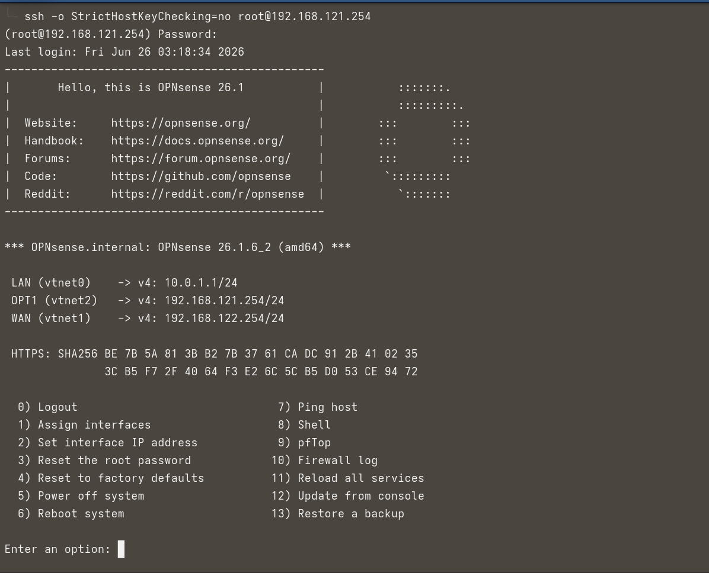
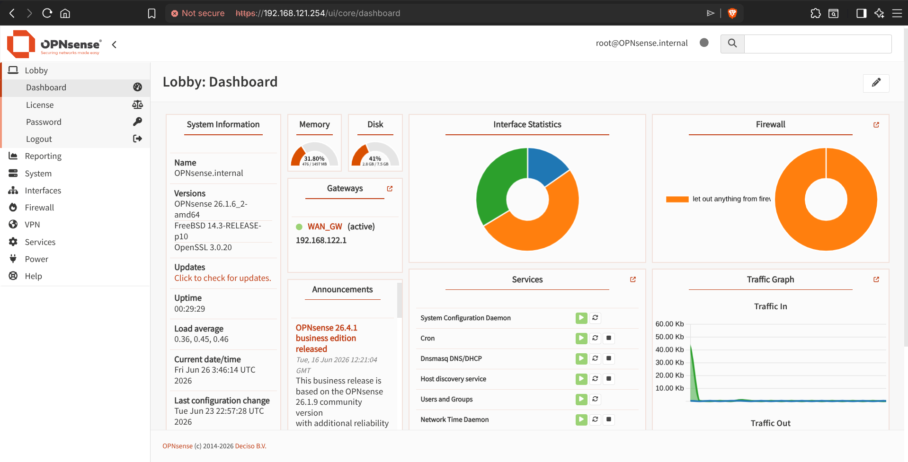
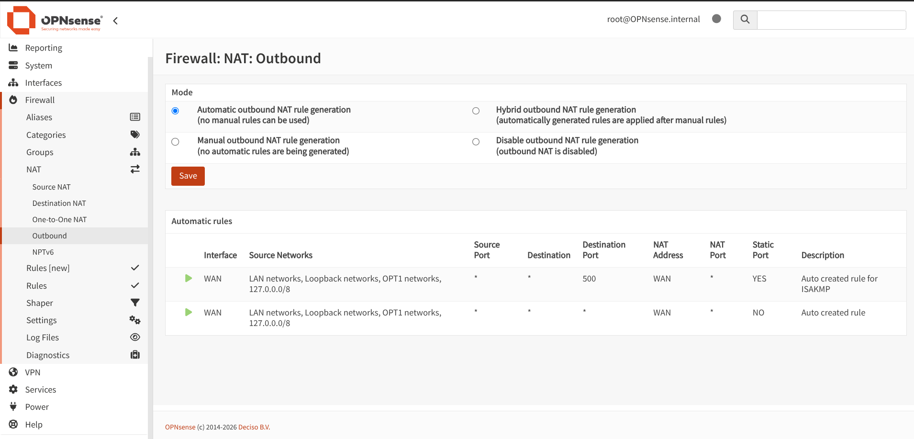
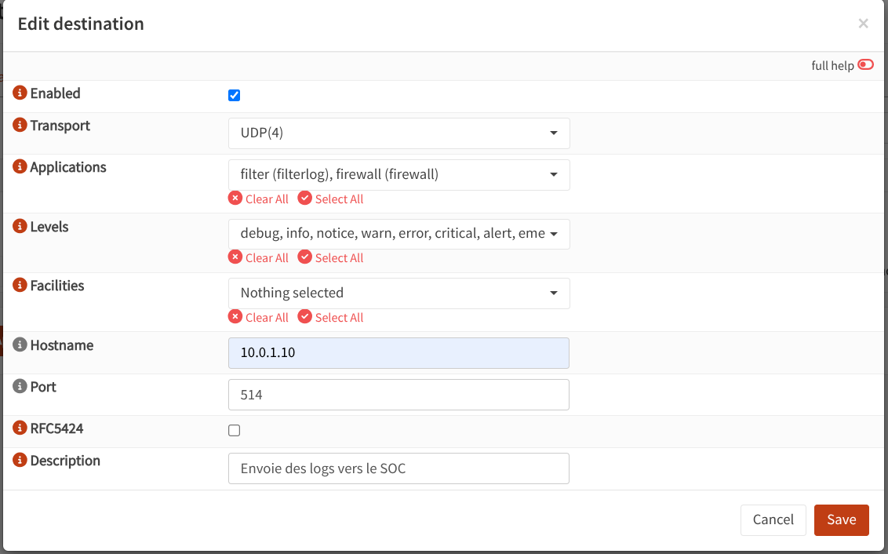

# OPNsense

## Installation

Pour créer la VM OPNsense, utiliser le script [opnsense_installation.sh](opnsense_installation.sh).

```bash
bash infrastructure/Opnsense/opnsense_installation.sh
```

Les paramètres suivants sont configurables en tête du script :
- `ISO_PATH` — chemin vers l'image ISO OPNsense
- `VM_NAME` — nom de la VM
- `MEMORY_MB` — quantité de RAM (défaut : `1536`)
- `DISK_SIZE_GB` — taille du disque (défaut : `8`)

## Configuration

### Accès SSH sur OPNsense

Par défaut, **SSH ne répond pas** sur `192.168.121.254`. Deux causes possibles :

- SSH n'est pas activé sur OPNsense

- Le firewall bloque l'interface `OPT1`

#### Activation depuis le shell OPNsense (option 8 dans virt-viewer)

[](../Screenshots/SSH-opnsense.png)

```bash
# 1. Vérifier si sshd tourne
ps aux | grep sshd

# 2. Activer SSH dans la config OPNsense
/usr/local/sbin/opnsense-shell sshd enable 2>/dev/null || \
  echo 'openssh_enable="YES"' >> /etc/rc.conf

# 3. Démarrer sshd
service sshd start || /usr/local/etc/rc.d/openssh start

# 4. Vérifier la config SSH
grep -E "PermitRootLogin|Port|ListenAddress" /etc/ssh/sshd_config

# 5. Vérifier que le processus tourne
ps aux | grep sshd
```

#### Connexion depuis l'hôte

```bash
ssh -o StrictHostKeyChecking=no root@192.168.121.254
```

#### Automatisation de la post-configuration

Une fois SSH opérationnel, lancer le script [opnsense_configuration.sh](opnsense_configuration.sh) depuis l'hôte :

```bash
bash infrastructure/Opnsense/opnsense_configuration.sh
```

Ce script automatise :
- La configuration SSH persistante
- Le forwarding des logs vers le SOC (`10.0.1.10:514`)
- La création d'un snapshot baseline
- L'extraction et le versioning de `config.xml`

#### Configuration des règles firewall/NAT

Les règles firewall, NAT et routage se configurent via l'**interface web** OPNsense (`https://192.168.121.254`) :

1. Se connecter en admin sur l'interface web
   [](../Screenshots/Opnsense-dashboard.png)

2. Configurer le routage sortant (NAT Outbound) pour permettre aux VMs internes d'accéder à Internet :
   [](../Screenshots/opnsense-outbound.png)

3. Configurer la redirection de ports (Port Forward) si nécessaire :
   [](../Screenshots/Opnsense-forward.png)

4. Une fois la configuration validée, lancer le script de post-configuration ci-dessus pour sauvegarder automatiquement `config.xml` dans le dépôt

Le fichier `config.xml` est alors versionné et peut être réinjecté en cas de recréation de la VM.
