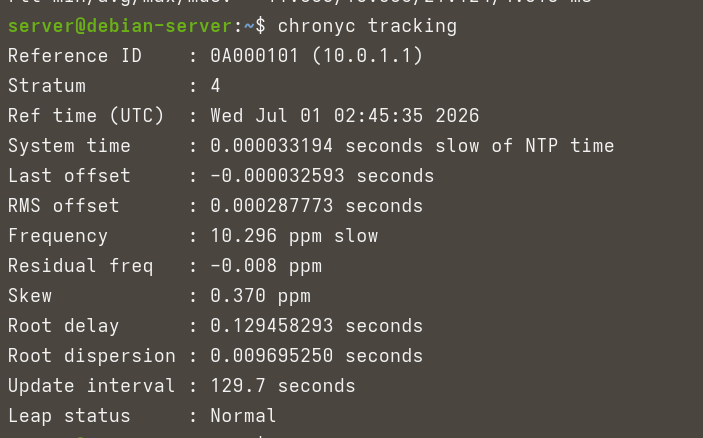
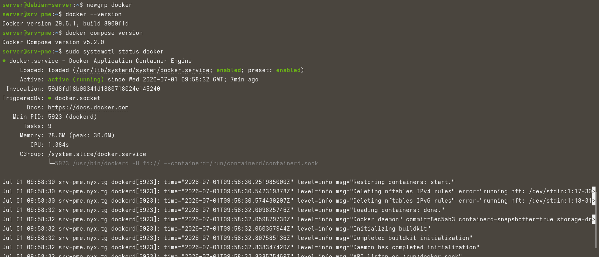
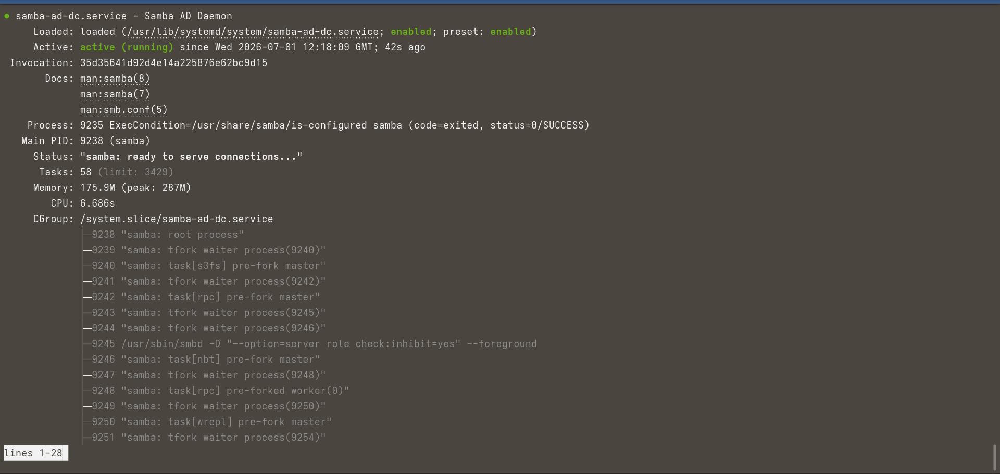
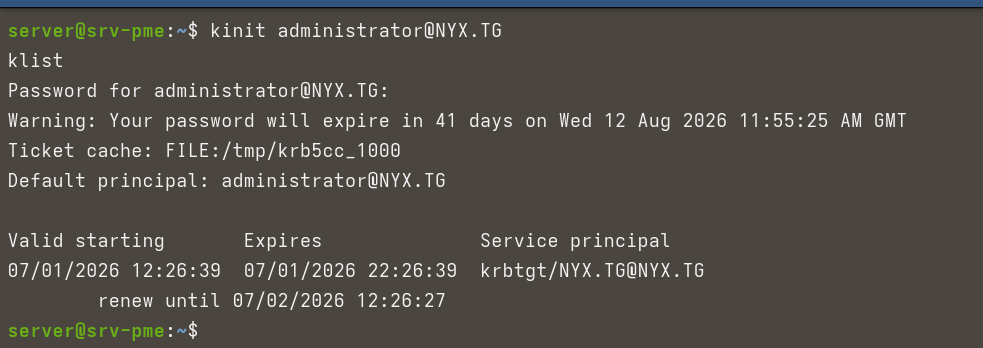
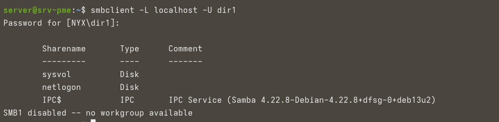

# Server

## Prérequis

Installer les outils nécessaires depuis votre poste :

```bash
# Sur Fedora/RHEL
sudo dnf install -y @virtualization virt-install virt-viewer
```

## Installation de la VM

Ce dossier sert à provisionner la VM Debian Server.

Pour créer la VM, utiliser le script [server_installation.sh](server_installation.sh) :

```bash
make server-install
```

Les paramètres configurables dans le script :
- `ISO_PATH` — chemin vers l'ISO Debian (défaut : `/home/adrien/Downloads/ISO/debian-13.5.0-amd64-netinst.iso`)
- `VM_NAME` — nom de la VM (défaut : `Server`)
- `MEMORY_MB` — quantité de RAM (défaut : `2048`)
- `DISK_SIZE_GB` — taille du disque (défaut : `8`)

## Configuration de base

Une fois la VM installée et le réseau configuré, appliquer la configuration :

```bash
make server-provision
```

### Hostname

Le hostname `srv-pme.nyx.tg` est appliqué automatiquement via :

```bash
sudo hostnamectl set-hostname srv-pme.nyx.tg
```

### Fichier hosts

Le fichier [`hosts.conf`](hosts.conf) doit être déployé dans `/etc/hosts`. Il contient :
- L'entrée locale pour le serveur
- L'entrée du réseau privé (10.0.1.20)

```bash
sudo cp hosts.conf /etc/hosts
```

## Base Installation

Le script [base_installation.sh](base_installation.sh) installe :

- **Hostname** : `srv-pme.nyx.tg`
- **Outils de base** : vim, curl, net-tools, acl, git
- **Interface privée** : configuration statique sur `enp2s0` (10.0.1.20/24)

## Chrony

Le fichier [`chrony.conf`](chrony.conf) configure NTP avec le serveur OPNsense (10.0.1.1) :

```bash
# Installation
sudo apt install -y chrony

# Déploiement de la config
sudo cp chrony.conf /etc/chrony/chrony.conf

# Redémarrage
sudo systemctl restart chrony
```

Vérification :

```bash
chronyc tracking
```

[](../Screenshots/chronyc-tracking.png)

## Docker

Le script [docker_install.sh](docker_install.sh) installe Docker CE et Docker Compose :

```bash
sudo bash docker_install.sh
```

[](../Screenshots/docker_installed_successfully.png)

Ce script :
- Ajoute la clé GPG officielle Docker
- Configure le dépôt APT Docker
- Installe `docker-ce`, `docker-ce-cli`, `containerd.io`, `docker-buildx-plugin`, `docker-compose-plugin`
- Ajoute l'utilisateur au groupe `docker`

Pour déployer depuis votre poste :

```bash
scp infrastructure/Server/docker_install.sh user@10.0.1.20:/tmp/
ssh user@10.0.1.20 'sudo bash /tmp/docker_install.sh'
```

## Samba AD DC

Le script [samba-ad_installation.sh](samba-ad_installation.sh) transforme le serveur en contrôleur de domaine Active Directory.

### Installation

```bash
make server-samba-ad
```

Ce script :
- Installe Samba 4, Kerberos, Winbind et les dépendances
- Provisionne le domaine `NYX.TG` avec `samba-tool domain provision`
- Crée les groupes `direction`, `comptabilite`, `technique`
- Crée les utilisateurs `dir1`, `comptal`, `tech1`, `soc_reader`

### Vérification

```bash
make server-samba-verify
```

[](../Screenshots/samba-ad_running.png)

[](../Screenshots/kerberos_working.png)

[](../Screenshots/connexion_dir1.png)