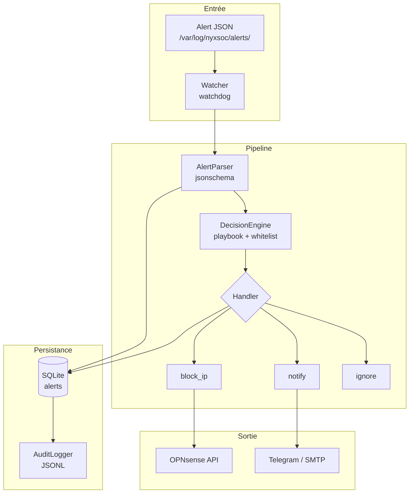

# NyxSOC — Module SOAR


Security Orchestration, Automation and Response pour l'infrastructure NyxSOC.

---

## Architecture



## Fonctionnement

1. **Watcher** surveille `/var/log/nyxsoc/alerts/` avec `watchdog` (inotify)
2. Fichier JSON atomique (`.tmp` → `.json`) → déclenche le pipeline
3. **AlertParser** valide le JSON contre `docs/alert-schema.json`
4. **DecisionEngine** applique : sévérité, whitelist, AbuseIPDB score, playbook
5. **Handler** exécute l'action : `block_ip` (OPNsense), `notify` (Telegram/SMTP), ou `ignore`
6. **Réponse** persistée dans SQLite + log JSONL

---

## Quick Start

### Prérequis

- Python 3.12+
- OPNsense VM accessible avec clé API
- Alias `soar_blocklist` créé sur OPNsense (type `Host(s)`)
- Règle firewall bloquant `soar_blocklist` → any

### Installation

```bash
cd ~/NYX/soar
python3.12 -m venv .venv
source .venv/bin/activate
pip install -r requirements.txt
cp .env.example .env   # renseigner les clés
```

### Lancement

```bash
PYTHONPATH=src .venv/bin/python -m soar.main
```

Déposer une alerte dans `/var/log/nyxsoc/alerts/` :

```bash
mv alert.json.tmp /var/log/nyxsoc/alerts/alert.json
```

Arrêt propre : `Ctrl+C` ou `kill <pid>`.

---

## Structure

| Couche | Dossier |
|--------|---------|
| Entry point | `src/soar/main.py` |
| Orchestrateur | `src/soar/orchestrator/` |
| Moteur de décision | `src/soar/engine/` |
| Parsing alerte | `src/soar/parser/` |
| Surveillant fichier | `src/soar/watcher/` |
| Intégrations | `src/soar/integrations/` (OPNsense, AbuseIPDB) |
| Handlers | `src/soar/handlers/` (block_ip, notify, ignore + handlers spécifiques S1/S2/S3) |
| Persistance | `src/soar/db/` + `src/soar/repositories/` |
| Logging | `src/soar/logging/` |
| Notifications | `src/soar/notifications/` (Telegram, SMTP) |
| Config | `src/soar/config/` |

## Configuration

### `.env`

| Variable | Obligatoire | Défaut | Description |
|----------|-------------|--------|-------------|
| `OPNSENSE_API_URL` | ✅ | — | URL de l'OPNsense (ex: `https://10.0.1.1`) |
| `OPNSENSE_API_KEY` | ✅ | — | Clé API OPNsense |
| `OPNSENSE_API_SECRET` | ✅ | — | Secret API OPNsense |
| `OPNSENSE_VERIFY_SSL` | ❌ | `true` | `false` pour certificat auto-signé |
| `ABUSEIPDB_API_KEY` | ❌ | — | Clé API AbuseIPDB (enrichissement) |
| `TELEGRAM_BOT_TOKEN` | ❌ | — | Token bot Telegram |
| `TELEGRAM_CHAT_ID` | ❌ | — | Chat ID Telegram |
| `SMTP_HOST` | ❌ | — | Serveur SMTP |
| `SMTP_PORT` | ❌ | `587` | Port SMTP |
| `SMTP_USER` | ❌ | — | Utilisateur SMTP |
| `SMTP_PASSWORD` | ❌ | — | Mot de passe SMTP |
| `NOTIFY_EMAIL` | ❌ | — | Destinataire des notifications |

## Structure du projet

```
soar/
├── src/soar/
│   ├── main.py                  # Point d'entrée, signaux, scheduler
│   ├── config/
│   │   ├── settings.py          # Chargement .env + config.yaml
│   │   └── config.yaml          # Configuration SOAR
│   ├── models/
│   │   ├── alert.py
│   │   ├── decision.py
│   │   └── response.py
│   ├── parser/
│   │   └── alert_parser.py
│   ├── watcher/
│   │   └── alert_watcher.py
│   ├── engine/
│   │   ├── decision_engine.py
│   │   └── rules.py
│   ├── handlers/
│   │   ├── base_handler.py
│   │   ├── core.py
│   │   ├── handler.py
│   │   ├── ssh_handler.py
│   │   ├── smb_handler.py
│   │   └── s3_handler.py
│   ├── integrations/
│   │   ├── opnsense_client.py
│   │   ├── abuseipdb_client.py
│   │   └── base.py
│   ├── db/
│   │   ├── connection.py
│   │   ├── schema.sql
│   │   └── migrations/
│   ├── repositories/
│   │   ├── alert_repository.py
│   │   ├── response_repository.py
│   │   └── audit_repository.py
│   ├── logging/
│   │   ├── soar_log.py
│   │   ├── audit_logger.py
│   │   └── response_writer.py
│   └── notifications/
│       └── notifier.py
├── tests/
├── scripts/
├── .env.example
├── pyproject.toml
└── requirements.txt
```

---

## Contrat d'intégration moteur → SOAR

| Règle | Détail |
|-------|--------|
| Dossier | `/var/log/nyxsoc/alerts/` |
| Format | JSON conforme à `docs/alert-schema.json` |
| Écriture | Atomique : `.tmp` → `rename()` → `.json` |
| Cycle de vie | Le moteur écrit, le SOAR lit (ne supprime jamais) |

Le contrat complet est documenté dans `docs/INTEGRATION.md`.

---

## OPNsense

### Configuration manuelle (à faire une fois)

1. **Firewall → Aliases → Add** : nom `soar_blocklist`, type `Host(s)`
2. **Firewall → Rules → LAN → Add** : source `soar_blocklist`, action `Block`
3. **System → Access → Users** : générer une clé API

### API utilisée

- `POST /api/firewall/alias/import` — import du contenu de l'alias (form-data)
- `POST /api/firewall/alias/reconfigure` — appliquer les changements
- `GET /api/firewall/alias/searchItem` — lister les IP bloquées

---

## Tests

```bash
cd ~/NYX/soar
.venv/bin/python -m pytest -v
# 127 tests, ~2s
```
