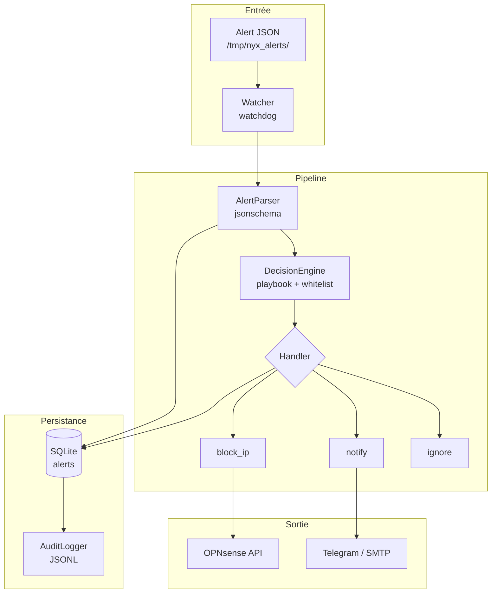

# NyxSOC — Module SOAR


Security Orchestration, Automation and Response pour l'infrastructure NyxSOC.

---

## Architecture



## Fonctionnement

1. **Watcher** surveille `/tmp/nyx_alerts/` avec `watchdog` (inotify)
2. Fichier JSON atomique (`.tmp` → `.json`) → déclenche le pipeline
3. **AlertParser** valide le JSON contre `docs/alert-schema.json`
4. **DecisionEngine** applique : sévérité, whitelist, AbuseIPDB score, playbook
5. **Handler** exécute l'action : `block_ip` (OPNsense), `notify` (Telegram/SMTP), ou `ignore`
6. **Réponse** persistée dans SQLite + log JSONL

---

## Quick Start

### Prérequis

- Python 3.12+
- OPNsense VM accessible avec clé API
- Alias `soar_blocklist` créé sur OPNsense (type `Host(s)`)
- Règle firewall bloquant `soar_blocklist` → any

### Installation

```bash
cd ~/NYX/soar
python3.12 -m venv .venv
source .venv/bin/activate
pip install -r requirements.txt
cp .env.example .env   # renseigner les clés
```

### Lancement

```bash
PYTHONPATH=src .venv/bin/python -m soar.main
```

Déposer une alerte dans `/tmp/nyx_alerts/` :

```bash
# Écriture atomique : .tmp → .json
mv alert.json.tmp /tmp/nyx_alerts/alert.json
```

Arrêt propre : `Ctrl+C` ou `kill <pid>`.

---

## Configuration

### `.env`

| Variable | Obligatoire | Défaut | Description |
|----------|-------------|--------|-------------|
| `OPNSENSE_API_URL` | ✅ | — | URL de l'OPNsense (ex: `https://10.0.1.1`) |
| `OPNSENSE_API_KEY` | ✅ | — | Clé API OPNsense |
| `OPNSENSE_API_SECRET` | ✅ | — | Secret API OPNsense |
| `OPNSENSE_VERIFY_SSL` | ❌ | `true` | `false` pour certificat auto-signé |
| `ABUSEIPDB_API_KEY` | ❌ | — | Clé API AbuseIPDB (enrichissement) |
| `TELEGRAM_BOT_TOKEN` | ❌ | — | Token bot Telegram |
| `TELEGRAM_CHAT_ID` | ❌ | — | Chat ID Telegram |
| `SMTP_HOST` | ❌ | — | Serveur SMTP |
| `SMTP_PORT` | ❌ | `587` | Port SMTP |
| `SMTP_USER` | ❌ | — | Utilisateur SMTP |
| `SMTP_PASSWORD` | ❌ | — | Mot de passe SMTP |
| `NOTIFY_EMAIL` | ❌ | — | Destinataire des notifications |

### `config/config.yaml`

| Clé | Défaut | Description |
|-----|--------|-------------|
| `soar.severity_threshold` | `CRITICAL` | Seuil minimal de sévérité |
| `soar.response_timeout_s` | `5` | Timeout des handlers (secondes) |
| `soar.abuseipdb_score_threshold` | `50` | Score AbuseIPDB min pour `block_ip` |
| `paths.alerts_incoming` | `/tmp/nyx_alerts/` | Dossier surveillé par le watcher |

---

## Structure du projet

```
soar/
├── src/soar/
│   ├── main.py                  # Point d'entrée, signaux, scheduler
│   ├── config/
│   │   ├── settings.py          # Chargement .env + config.yaml
│   │   └── config.yaml          # Configuration SOAR
│   ├── models/
│   │   ├── alert.py             # Dataclass Alert
│   │   ├── decision.py          # Dataclass Decision
│   │   └── response.py          # Dataclass Response
│   ├── parser/
│   │   └── alert_parser.py      # Validation JSON Schema → Alert
│   ├── watcher/
│   │   └── alert_watcher.py     # Watchdog inotify, dedup, preload
│   ├── engine/
│   │   ├── decision_engine.py   # Logique de décision
│   │   └── rules.py             # Playbook + whitelist
│   ├── handlers/
│   │   └── handler.py           # block_ip, notify, ignore
│   ├── integrations/
│   │   ├── opnsense_client.py   # API OPNsense (import/searchItem)
│   │   ├── abuseipdb_client.py  # API AbuseIPDB + circuit breaker
│   │   └── base.py              # Base API client (retry)
│   ├── db/
│   │   ├── connection.py        # SQLite connection manager
│   │   ├── schema.sql
│   │   └── migrations/
│   ├── repositories/
│   │   ├── alert_repository.py
│   │   ├── response_repository.py
│   │   └── audit_repository.py
│   ├── logging/
│   │   ├── soar_log.py          # Logging standard avec rotation
│   │   ├── audit_logger.py      # Audit JSONL + SQLite
│   │   └── response_writer.py   # Persistance des réponses
│   └── notifications/
│       └── notifier.py          # Telegram + SMTP + daily summary
├── tests/
│   ├── unit/          (16 fichiers, ~110 tests)
│   └── integration/   (1 fichier, test OPNsense mocké)
├── docs/              # Documentation par étape (step-01 à step-14)
├── scripts/           # rotate_logs, generate_report, cleanup_rules
├── .env.example
├── pyproject.toml
└── requirements.txt
```

---

## Contrat d'intégration moteur → SOAR

| Règle | Détail |
|-------|--------|
| Dossier | `/tmp/nyx_alerts/` |
| Format | JSON conforme à `docs/alert-schema.json` |
| Écriture | Atomique : `.tmp` → `rename()` → `.json` |
| Cycle de vie | Le moteur écrit, le SOAR lit (ne supprime jamais) |

Le contrat complet est documenté dans `docs/INTEGRATION.md`.

---

## OPNsense

### Configuration manuelle (à faire une fois)

1. **Firewall → Aliases → Add** : nom `soar_blocklist`, type `Host(s)`
2. **Firewall → Rules → LAN → Add** : source `soar_blocklist`, action `Block`
3. **System → Access → Users** : générer une clé API

### API utilisée

- `POST /api/firewall/alias/import` — import du contenu de l'alias (form-data)
- `POST /api/firewall/alias/reconfigure` — appliquer les changements
- `GET /api/firewall/alias/searchItem` — lister les IP bloquées

---

## Tests

```bash
cd ~/NYX/soar
.venv/bin/python -m pytest -v
# 111 tests, ~27s
```

Tests unitaires : engine, parser, watcher, handlers, repositories, logging, notifier, cache.
Tests intégration : client OPNsense (mocké).

---

## Documentation

Chaque étape du développement est documentée dans `soar/docs/` :

| Doc | Sujet |
|-----|-------|
| `step-00` | Environnement |
| `step-01` | Modèles de données |
| `step-02` | Configuration |
| `step-03` | Parser |
| `step-04` | Watcher |
| `step-05` | Cache IP |
| `step-06` | Client AbuseIPDB |
| `step-07` | Client OPNsense |
| `step-08` | Decision Engine |
| `step-09` | Handlers |
| `step-10` | Orchestrateur |
| `step-11` | Base de données |
| `step-12` | Logging |
| `step-13` | Notifications |
| `step-14` | Point d'entrée |
